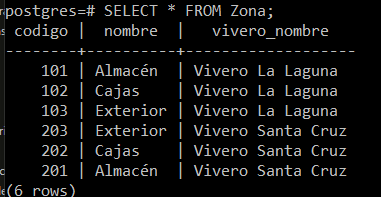
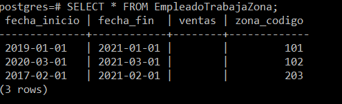
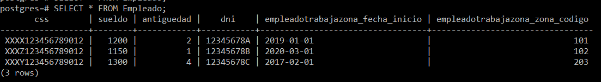
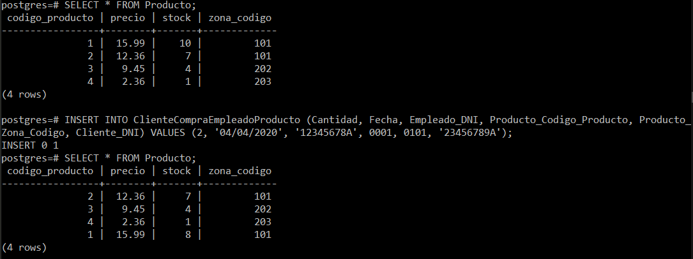
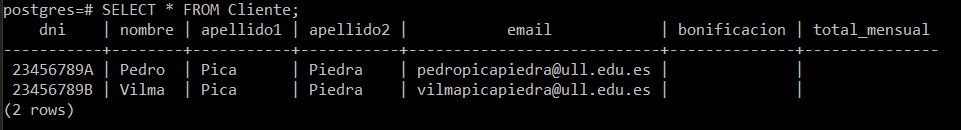
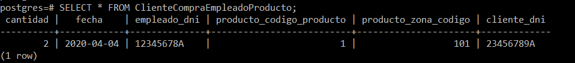

# Práctica 5: Modelo Lógico Relacional (Disparadores): Viveros

En primer lugar, hemos creado la función *crear_email*. El objetivo de la función es el de comprobar si nuestro usuario ha introducido un correo correcto, de no ser así se creará uno nuevo concatenando el nombre y los apellidos del usuario junto con el dominio que se le pase como parámentro a dicha función.

```sql
-- --------------------------------------
-- Function crear_email
-- Crear un procedimiento 'crear_email' devuelva una dirección de correo electrónico compuesta por el nombre, los apellidos, el carácter '@' y un dominio pasádo como parámetro.
-- --------------------------------------
DROP FUNCTION IF EXISTS crear_email;
CREATE OR REPLACE FUNCTION crear_email() RETURNS TRIGGER AS $crear_email$
  DECLARE newEmail VARCHAR(100);
  BEGIN
    IF ((new.Email NOT LIKE '^[A-Z0-9._%-]+@[A-Z0-9.-]+\.[A-Z]{2,4}$') AND
        (new.Email IS NOT NULL)) THEN
      RAISE EXCEPTION 'El correo no es valido';
    END IF;

    IF new.Email IS NULL THEN
      new.Email := CONCAT(
        LOWER(new.Nombre),
        LOWER(new.Apellido1),
        LOWER(new.Apellido2),
        '@',
        LOWER(TG_ARGV[0])
      );
    END IF;

    RETURN NEW;
  END;
$crear_email$ LANGUAGE plpgsql;

-- --------------------------------------
-- Trigger trigger_crear_email_before_insert
-- Crear un disparador que permita crear una dirección de correo electrónico en el caso de que no se disponga ya de una.
-- --------------------------------------
CREATE TRIGGER trigger_crear_email_before_insert
  BEFORE INSERT ON Cliente
  FOR EACH ROW EXECUTE PROCEDURE crear_email('ull.edu.es');
```

En segundo lugar, hemos creado la funcion *comprobar_zona* cuyo objetivo es comprobar que dos empleados no trabajan en la misma zona, mostrando un mensaje de error en el caso de que sucediera.

```sql
-- --------------------------------------
-- Function comprobar_zona
-- --------------------------------------
DROP FUNCTION IF EXISTS comprobar_zona;
CREATE OR REPLACE FUNCTION comprobar_zona() RETURNS TRIGGER AS $comprobar_zona$
  BEGIN
    IF EXISTS(SELECT * FROM Empleado WHERE (
          Empleado.EmpleadoTrabajaZona_Zona_Codigo = new.EmpleadoTrabajaZona_Zona_Codigo
        )) THEN
      RAISE EXCEPTION 'No pueden trabajar en la misma zona';
    END IF;

    RETURN NEW;
  END;
$comprobar_zona$ LANGUAGE plpgsql;

-- --------------------------------------
-- Trigger trigger_Empleado_Trabaja_Una_zona
-- Crear un disparador que permita verificar que en cada zona de un vivero no pueden trabajar dos personas diferentes.
-- --------------------------------------
CREATE TRIGGER trigger_Empleado_Trabaja_Una_zona
  BEFORE INSERT ON Empleado
    FOR EACH ROW EXECUTE PROCEDURE comprobar_zona();
END;
```

Por ultimo, hemos creado la funcion *actualizar_stock*, su objetivo es el de actualizar de forma continua el stock de todos los productos ofertados en cada zona de un vivero.

```sql
-- --------------------------------------
-- Function actualizar_Stock
-- --------------------------------------
DROP FUNCTION IF EXISTS actualizar_Stock;
CREATE OR REPLACE FUNCTION actualizar_Stock()
    RETURNS TRIGGER AS $actualizar_Stock$
  BEGIN
    IF EXISTS(SELECT * FROM Producto WHERE (
        (Producto.Codigo_Producto = new.Producto_Codigo_Producto) AND
        (Producto.Zona_Codigo = new.Producto_Zona_Codigo) AND
        (Producto.Stock >= new.Cantidad))) THEN
      UPDATE Producto SET Stock = (Producto.Stock - new.Cantidad) WHERE (
          (Producto.Codigo_Producto = new.Producto_Codigo_Producto) AND
          (Producto.Zona_Codigo = new.Producto_Zona_Codigo) AND
          (Producto.Stock >= new.Cantidad));
    END IF;

    RETURN NEW;
  END;
$actualizar_Stock$ LANGUAGE plpgsql;

-- --------------------------------------
-- Trigger trigger_actualizar_stock
-- Crear un disparador que permita mantener actualizado el stock de la base de datos de viveros.
-- --------------------------------------
CREATE TRIGGER trigger_actualizar_stock
  BEFORE INSERT ON ClienteCompraEmpleadoProducto
    FOR EACH ROW EXECUTE PROCEDURE actualizar_Stock();
END;

```

## Capturas de las tablas tras las inserciones

<div align="center">
  <br>
  
  <br>
  <br>
</div>

---

<div align="center">
  <br>
  
  <br>
  <br>
</div>

---

<div align="center">
  <br>
  
  <br>
  <br>
</div>

---

<div align="center">
  <br>
  
  <br>
  <br>
</div>

---

<div align="center">
  <br>
  
  <br>
  <br>
</div>

---

<div align="center">
  <br>
  
  <br>
  <br>
</div>

---

<div align="center">
  <br>
  
  <br>
  <br>
</div>
